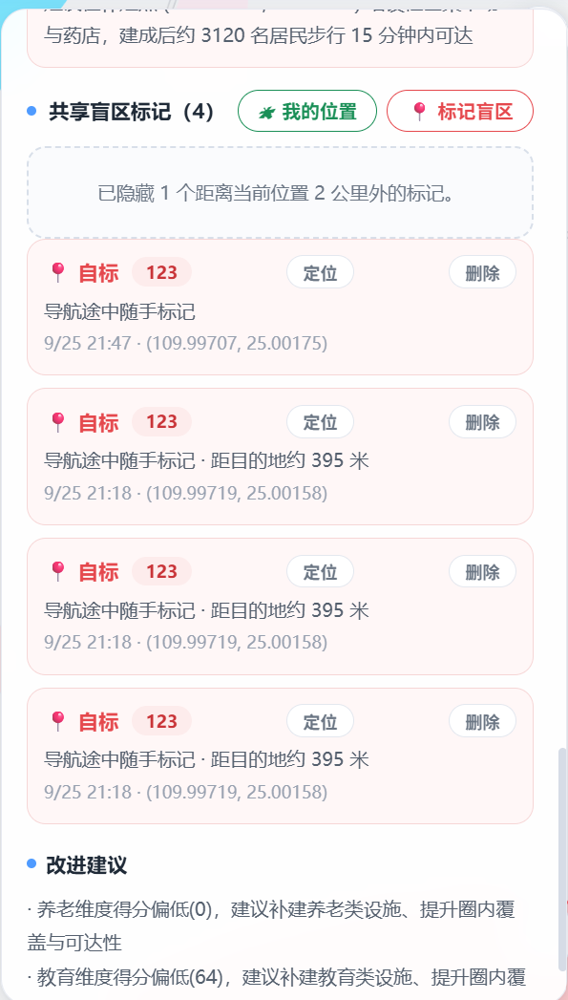
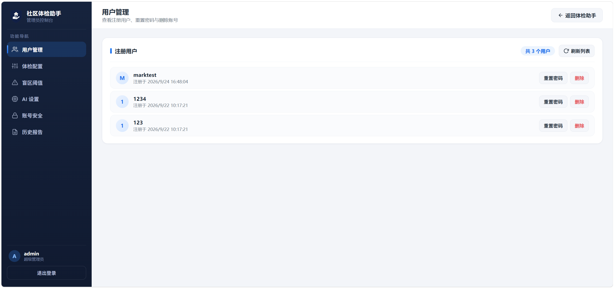
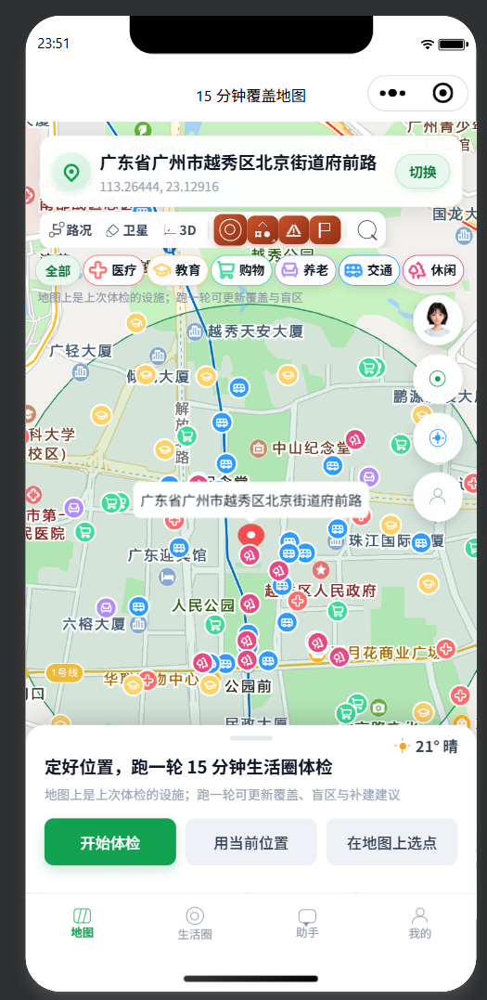
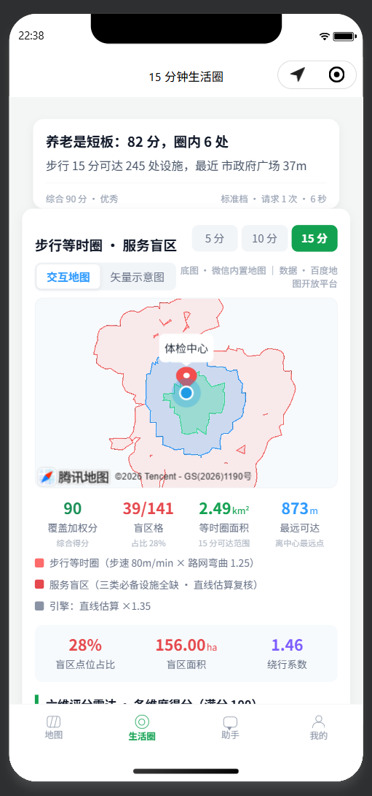
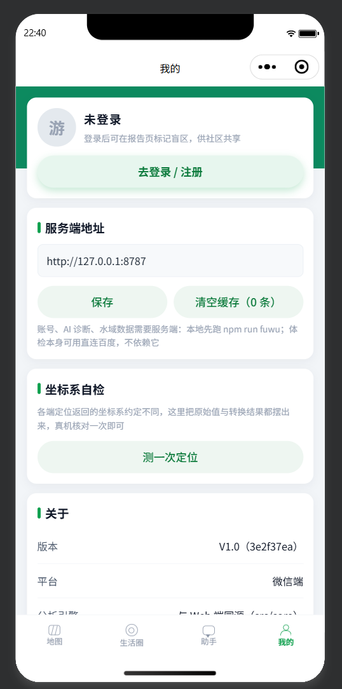

# 15 分钟便民生活圈 · 智能体检与规划助手


> 开源 AI 工具赛道参赛作品 · 作者：肖沐樑（QQ：3387432690） · 许可证：MIT

基于百度地图开放能力，输入社区中心点坐标，系统自动计算**真实步行路网**下的 15 分钟等时圈，
统计圈内民生设施覆盖，识别"服务盲区"，输出可导出、可复现的**社区生活圈体检报告**。

## 在线演示（免安装，打开即用）

| 部署平台 | 访问地址 |
|---|---|
| GitHub Pages | **https://lihua5645.github.io/15-minute-living-circle/** |

> 使用说明：打开页面允许浏览器定位（或直接拖动地图图钉 / 搜索框输入社区名选点），点击「开始体检」即可完整复现
> 等时圈计算 → 六类设施统计 → 盲区识别 → 可视化体检报告全流程。
> 纯静态演示版不含账号登录与 AI 在线问答（需本地服务），本地运行方式见下文「快速运行」。

---

## 下载桌面版（exe 安装包）

| 渠道 | 地址 |
|---|---|
| Gitee 发行版（当前下载渠道） | **https://gitee.com/zhang-san-zhangshan/15-minute-living-circle/releases/latest** |
| GitHub Releases | 暂未发布，后续上传后此链接自动生效：https://github.com/LIHUA5645/15-minute-living-circle/releases/latest |

- 安装包：`生活圈体检助手-Setup-*.exe`（Windows 10/11 x64，约 90 MB，NSIS 安装向导、可自选安装目录、自动创建桌面快捷方式）。
- 桌面端功能与在线版一致，另含**批量距离矩阵加速**与**磁盘缓存**（体检更快、更省配额）。
- 说明：账号登录 / 注册功能依赖本机 MySQL（在 `.env` 配置 `DB_HOST/DB_PORT/DB_USER/DB_PASS` 即可；不装 MySQL 不影响体检、地图、导航等主功能）。

> 自己打包：`npm run dist:win`，产物在 `release/` 目录；打包后在仓库「发行版 / Releases」页新建版本并上传附件即可供下载。

---

## 一、特性

- **真实路网等时圈**：扇形方位采样 → 割线法边界收敛 → 各向异性 IDW 插值 → Marching Squares 等值线 → 采样路网吸附，边界贴合真实道路而非"画圆"。
- **多源 POI 清洗**：同义词检索、编辑距离去重、品牌去重、黑名单噪声过滤、可信度打分、分维归档。
- **服务盲区识别**：居住性过滤 + 粗筛 + 批量距离矩阵精算 + DBSCAN 聚类，输出补建建议清单。
- **六维评分报告**：医疗/教育/购物/养老/交通/休闲，雷达图 + 柱状图 + 仪表盘，一键导出 JSON。
- **多端复用**：分析引擎 `src/core` 零 DOM 依赖，Web / Electron / 小程序 / 安卓共用。
- **AI 增强**：管理员在控制台配置任意 OpenAI 兼容大模型（DeepSeek / 智谱 / 通义等）后，自动启用 AI 诊断叙述、AI 一句话导航选点、AI 在线问答（对话式界面，结合本轮体检结果作答）；未配置或调用失败时自动回退本地规则引擎，密钥经服务端中转、不落库。
- **账号体系**：用户注册 / 登录（MySQL 存储、密码加盐哈希）、个人主页（历史体检 / 等级分布 / 导出档案）、管理员控制台（用户管理、评分维度调参、盲区阈值、AI 配置与多套服务商档案切换）。
- **配额与容错**：令牌桶限流 + 并发池 + 三级缓存 + 退避重试 + 离线降级，全程可跑通演示。
- **小程序端（微信优先，兼容支付宝 / 抖音）**：与 Web 端共用同一份引擎与提示词，等时圈热力（含水域避让）、六维报告、盲区清单、AI 诊断与在线问答能力对齐；服务端地址**自动探测 + 断线自动重连**，`npm run fuwu:bg` 一键后台常驻。

### 近期更新

| 日期 | 内容 |
|---|---|
| 2026-10-07 | 小程序端 AI 问答修复：程序提示不再被当作「模型说过的话」喂回上下文（避免模型学舌谈后台配置）、提示词增加后台话题约定；小程序端新增服务端地址自动探测与断线自动重连（`npm run fuwu:bg` 常驻脚本） |
| 2026-10-06 | 新增小程序端（微信 / 支付宝 / 抖音三端同构）与 `xcx/*` 文档；AI 形象与网页端统一为 `AIlogo.png`；等时圈跨水面虚线轮廓；抽取 `fuwuqi/zhongJian.mjs` 供 Vite 与独立服务端共用；CI 增加小程序一致性检查 |

逐条修复细节见 [`修复记录文档.md`](./修复记录文档.md)。

## 二、应用截图

### 1. 主界面 · 地图与搜索

顶栏搜索地点即规划前往路线（步行 / 骑行 / 驾车 / 公交四方式并行规划，真实路网），左下控制面板一键体检。


### 2. 全景 · 体检控制与地图联动

选点体检 → 等时圈绘制 → 圈内设施打点，右侧报告面板实时联动。


### 3. AI 在线问答

结合本轮体检摘要作答，AI 找到的目的地一键确认即规划路线。


### 4. 服务盲区识别与标记

识别居住区 15 分钟步行圈覆盖不足的盲区并给出补建建议；登录用户可在地图上随手标记真实盲区，全员共享。



### 5. 管理员控制台

评分模型在线调参、设施盲区阈值动态配置、AI 诊断服务一键接入、用户管理。



### 6. 小程序端（微信优先，兼容支付宝 / 抖音）

与 Web 端共用同一份分析引擎：地图体检、等时圈热力、六维报告、AI 诊断与问答、站内导航一应俱全。

| 地图首页（体检入口 / 设施卡片 / 站内导航） | 生活圈页（评分雷达 / 等时圈 / AI 诊断） |
| --- | --- |
|  |  |

| AI 助手（结合诊断结论问答 / 语音与附件输入） | 我的（账号 / 服务端地址 / 坐标自检） |
| --- | --- |
|  |  |

## 三、目录结构

```
src/
  core/        分析引擎（纯 JS，零 DOM）
    geo/       几何工具
    isochrone/ 等时圈五阶段算法
    poi/       POI 检索与清洗
    blindspot/ 盲区识别
    scoring/   评分模型
    scheduler/ 限流/并发/缓存/降级
    pipeline.js 流水线编排
  adapters/    数据源适配器（bmapWeb / bmapServer / osm / mock）
  ui/          React 界面 + Canvas 可视化 + ECharts 报告
xcx/           小程序端（微信 / 支付宝 / 抖音三端同构）
  common/      跨端真源：平台适配层 + 页面逻辑 + AI + 坐标工具（core 由脚本同步）
  miniprogram/ 微信端工程（优先开发，用开发者工具打开）
  zhifubao/    支付宝端工程（.axml/.acss，由脚本生成视图）
  douyin/      抖音端工程（.ttml/.ttss，由脚本生成视图）
public/osm/    样例社区预下载路网（可完全离线复现）
fuwuqi/        自有服务端（配置/账号/百度代理/AI 中转/水域，可选）
electron/    桌面端壳（主进程 API 代理 + 磁盘缓存 + 打包）
tests/        vitest 单元测试 + 小程序三端自检

设计实录.md              技术设计文档（架构 / 算法 / 数据清洗 / 盲区识别）
真实对比测试报告.md      长沙·砂子塘社区 画圆法 vs 真实路网实测对比
xcx/设计方案.md          小程序端设计方案（三端结构 / 对接方式 / 页面映射）
xcx/README.md            小程序端对接与排错说明（服务端端点点表 / 坐标系 / 常见问题）
修复记录文档.md          开发修复记录
```

## 四、环境配置（AK 脱敏）

复制 `.env.example` 为 `.env`，按需填写：

```
VITE_BMAP_AK=浏览器端AK       # 地图渲染/检索/步行路线，百度控制台"应用类型=浏览器端"
BAIDU_SERVER_AK=服务端AK      # 可选，批量距离矩阵，桌面端 Electron 主进程使用
```

> AK 不硬编码进代码；未配置时自动使用**离线样例**模式，无需 AK 即可完整演示。

## 五、快速运行

```bash
# 1. 安装依赖
npm install

# 2. 开发（Web）
npm run dev            # 访问 http://localhost:5173

# 3. 构建 Web 产物
npm run build          # 产物在 dist/

# 4. 单元测试
npm run test

# 5. Docker 一键演示
docker compose up -d --build   # 访问 http://localhost:8080
```

### 部署方式一览（从本机到公网）

| 方式 | 命令 / 入口 | 说明 |
|---|---|---|
| 本地开发 | `npm run dev` → http://localhost:5173 | Vite 开发服务器同时挂着 `/api`（账号）、`/airelay`（AI 中转）、`/bmapapi`（百度代理，服务端代持 AK），所以**开发态就能用 AI 与账号** |
| 本地生产预览 | `npm run build` + `npm run preview` | 纯静态 `dist/`，**不含**上面三个中间件（AI 在线问答 / 账号不可用，其余功能照常） |
| Docker 一键 | `docker compose up -d --build` → http://localhost:8080 | `Dockerfile` + `docker/nginx.conf`；示例数据随仓库分发，评审零配置即可跑通演示 |
| 自有服务端托管 | `npm run fuwu:bg` → http://127.0.0.1:8787 | 一个进程同时提供 `/api` `/airelay` `/bmapapi` `/shuiyu` 与 `dist/` 静态页面；小程序端也连它（`npm run fuwu:stop` 停止） |
| GitHub Pages（公网演示） | 推 `master` 自动触发 `.github/workflows/deploy-pages.yml` | 线上地址见文首；Secret（`VITE_BMAP_AK`）与分支保护等一次性配置见 [`github部署方法.md`](./github部署方法.md) |
| Gitee Pages（国内镜像） | 构建 `dist/` → 推 `gh-pages` 分支 → Gitee 页面点「更新」 | 需实名认证 + 首次人工审核，见 `github部署方法.md` 第六节 |
| 桌面安装包 | `npm run dist:win` | 产物在 `release/`，上传到 Releases 供下载（当前 Gitee 发行版可下） |
| 小程序端 | 微信开发者工具导入目录 `xcx`；改完跑 `npm run xcx:tongbu` | 三端同构，详见「七、小程序端」与 [`xcx/README.md`](./xcx/README.md) |

## 六、桌面端打包（exe 安装包）

```bash
# 构建 Web 产物并由 electron-builder 打包 NSIS 安装包
npm run dist:win       # 产物在 release/生活圈体检助手-Setup-*.exe
```

桌面端主进程使用**服务端 AK** 通过 Web 服务 API 启用批量距离矩阵，并落盘缓存以降低配额。

## 七、小程序端（微信优先，兼容支付宝 / 抖音）

小程序端与 Web / 桌面端**共用同一份分析引擎**（`src/core` 零 DOM、零平台依赖，用 `scripts/tongbu-xcx.mjs` 同步进各端 `lib/`），所以等时圈、六维评分、盲区判定、AI 提示词与 Web 端逐字一致；三端差异只收敛在平台适配层（`xcx/common/plat*.js`）。

```bash
# 1. 同步引擎与共享层到三端工程（改完 src/core 或 xcx/common 都要跑一次）
npm run xcx:tongbu

# 2. 微信开发者工具「导入项目」→ 目录选 xcx（project.config.json 已就位，miniprogramRoot 指向 miniprogram/）
#    开发期在「详情 → 本地设置」勾上「不校验合法域名」；需要账号 / AI / 水域时起服务端
npm run fuwu:bg           # 服务端后台常驻（隐藏窗口 + 日志 fuwuqi/fuwu.log；已在跑则不会重复起）
npm run fuwu              # 或前台常驻（想直接看输出时用）
npm run fuwu:stop         # 停止常驻的服务端

# 3. 不装开发者工具也能自检（引擎同源 / 三端视图一致 / 提示词逐字一致）
npm run xcx:jiancha
npm run xcx:zijian
```

| 项 | 说明 |
|---|---|
| 数据通道 | 默认「直连百度（小程序 AK）→ 失败自动退服务端」双通道；也可在 `xcx/common/peizhi.js` 改 `bmapMoShi` 只走服务端 |
| 自动连上 | 服务端地址不必手填正确：客户端会按「上次可用 → 代码默认 → 服务端上报的内网候选」依次探测 `/jianKang`，谁通用谁；读不到配置时**每 6 秒自动重连一次（共 5 次）**，服务端后起也能自己接上，接不通才在界面上提示并给出当前地址 |
| 真机地址 | `/jianKang` 会把服务端所在机器的内网地址一并上报（如 `http://192.168.x.x:8787`），「我的」页可直接切；真机预览必须用内网 IP 或 HTTPS 穿透域名（`127.0.0.1` 指手机自己） |
| AK 说明 | 小程序端 AK（`peizhi.js` 的 `bmapAk`）按百度/微信规则**必须内置**在小程序里——它是「微信小程序」类型的客户端 AK，与浏览器端 AK 同类；服务端 AK 仍只走 `.env`，AI 密钥由服务端代持（中转时补齐、不落前端） |
| 界面 | 四 Tab 外壳（地图 / 生活圈 / 助手 / 我的，微信端为组件自绘、图标用 `.ic-*` CSS 语义图标）；「生活圈」页为结论卡 + 步行等时圈/服务盲区卡（时长档位、交互地图 ↔ 矢量示意图、面积/最远可达/绕行系数/盲区格等指标、图例、分类缺口）+ 六维 + 盲区清单 + AI 诊断 |
| 能力对齐 | 等时圈热力图（含水域避让与跨水面虚线）、设施 / 盲区 / 我的标记三类图层、六维报告（横向条形 + 盲区清单 + 补建点）、AI 诊断与在线问答、共享盲区标记、坐标系自检 |
| 离线可用 | `public/osm/` 预置路网与水域随仓库分发；服务端不可用时 POI 检索降级为直线估算，体检结论仍出（如实标注来源） |
| 详细文档 | `xcx/设计方案.md`（方案 / 页面映射 / 三端差异）、`xcx/README.md`（对接端点点表、坐标系约定、排错手册） |

## 八、API 调用策略要点

| 能力 | 接口 | 用途 |
|---|---|---|
| 地图渲染 | BMap GL JS SDK | 底图/覆盖物/热力 |
| 地理/逆地理编码 | Geocoder / geocoding(v3) | 地址↔坐标、居住性判断 |
| POI 检索 | LocalSearch / place/v2/search | 民生设施采集 |
| 步行路径规划 | WalkingRoute / direction/v2/walking | 等时圈边界 |
| 批量距离矩阵 | routematrix/v1/walking | 盲区批量判定（降耗时核心） |

**等时圈算法**：`r0 = v·T/k`（v=80m/min，k=1.25）≈ 960m；每个方位用割线法求"耗时=15min"边界半径；
迭代过程采样点构造各向异性 IDW 插值场（`w=1/(d²·(1+α·Δθ))`），Marching Squares 提取等值线并吸附到采样路网。

## 九、CI/CD

`.github/workflows/ci.yml`：Prettier 格式检查 + ESLint + vitest 测试 + Web 构建 + **小程序三端一致性检查（`xcx:jiancha`）与 28 项自检（`xcx:zijian`）**，推送即触发；`deploy-pages.yml` 负责 Pages 部署。

## 十、许可证

MIT License，详见 `LICENSE`。
